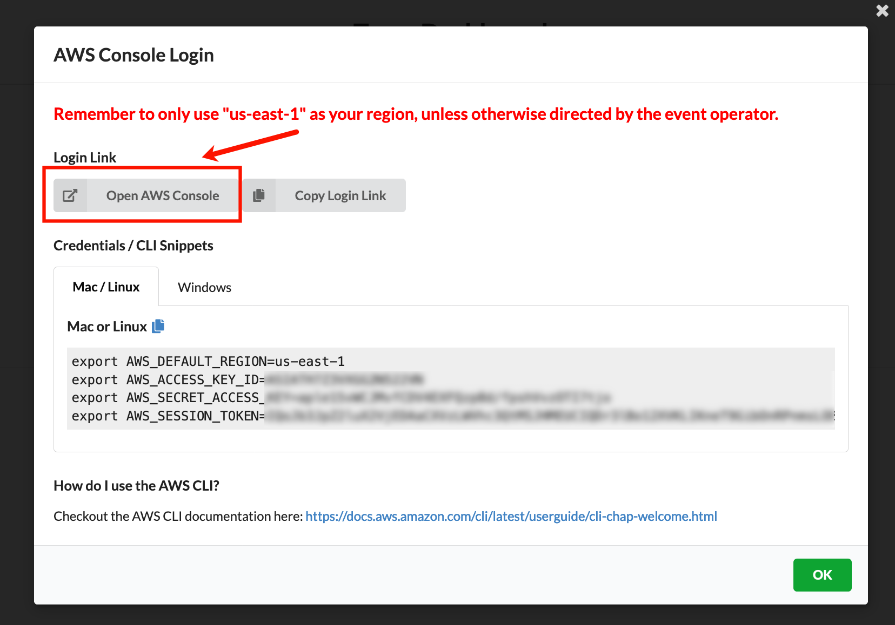
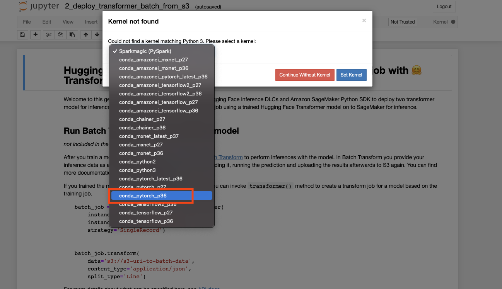

[Coped from original asset: https://github.com/philschmid/huggingface-sagemaker-workshop-series in order to modify]
# Workshop: Enterprise-Scale NLP with Hugging Face & Amazon SageMaker

Earlier this year we announced a strategic collaboration with Amazon to make it easier for companies to use Hugging Face Transformers in Amazon SageMaker, and ship cutting-edge Machine Learning features faster. We introduced new Hugging Face Deep Learning Containers (DLCs) to train and deploy Hugging Face Transformers in Amazon SageMaker.

In addition to the Hugging Face Inference DLCs, we created a [Hugging Face Inference Toolkit for SageMaker](https://github.com/aws/sagemaker-huggingface-inference-toolkit). This Inference Toolkit leverages the `pipelines` from the `transformers` library to allow zero-code deployments of models, without requiring any code for pre-or post-processing. 

In October and November, we held a workshop series on “**Enterprise-Scale NLP with Hugging Face & Amazon SageMaker**”. This workshop series consisted out of 3 parts and covers:

- Getting Started with Amazon SageMaker: Training your first NLP Transformer model with Hugging Face and deploying it
- Going Production: Deploying, Scaling & Monitoring Hugging Face Transformer models with Amazon SageMaker
- MLOps: End-to-End Hugging Face Transformers with the Hub & SageMaker Pipelines

We recorded all of them so you are now able to do the whole workshop series on your own to enhance your Hugging Face Transformers skills with Amazon SageMaker or vice-versa. 

Below you can find all the details of each workshop and how to get started. 

🧑🏻‍💻 Github Repository: https://github.com/philschmid/huggingface-sagemaker-workshop-series

📺  Youtube Playlist: [https://www.youtube.com/playlist?list=PLo2EIpI_JMQtPhGR5Eo2Ab0_Vb89XfhDJ](https://www.youtube.com/playlist?list=PLo2EIpI_JMQtPhGR5Eo2Ab0_Vb89XfhDJ)

 *Note: The Repository contains instructions on how to access a temporary AWS, which was available during the workshops. To be able to do the workshop now you need to use your own or your company AWS Account.*
 
In Addition to the workshop we created a fully dedicated [Documentation](https://huggingface.co/docs/sagemaker/main) for Hugging Face and Amazon SageMaker, which includes all the necessary information.
If the workshop is not enough for you we also have 15 additional getting samples [Notebook Github repository](https://github.com/huggingface/notebooks/tree/master/sagemaker), which cover topics like distributed training or leveraging [Spot Instances](https://aws.amazon.com/ec2/spot/?nc1=h_ls&cards.sort-by=item.additionalFields.startDateTime&cards.sort-order=asc).
 

## Workshop 1: **Getting Started with Amazon SageMaker: Training your first NLP Transformer model with Hugging Face and deploying it**

In Workshop 1 you will learn how to use Amazon SageMaker to train a Hugging Face Transformer model and deploy it afterwards.

- Prepare and upload a test dataset to S3
- Prepare a fine-tuning script to be used with Amazon SageMaker Training jobs
- Launch a training job and store the trained model into S3
- Deploy the model after successful training

---

🧑🏻‍💻 Code Assets: [https://github.com/philschmid/huggingface-sagemaker-workshop-series/tree/main/workshop_1_getting_started_with_amazon_sagemaker](https://github.com/philschmid/huggingface-sagemaker-workshop-series/tree/main/workshop_1_getting_started_with_amazon_sagemaker)

📺 Youtube: [https://www.youtube.com/watch?v=pYqjCzoyWyo&list=PLo2EIpI_JMQtPhGR5Eo2Ab0_Vb89XfhDJ&index=6&t=5s&ab_channel=HuggingFace](https://www.youtube.com/watch?v=pYqjCzoyWyo&list=PLo2EIpI_JMQtPhGR5Eo2Ab0_Vb89XfhDJ&index=6&t=5s&ab_channel=HuggingFace)

## Workshop 2: **Going Production: Deploying, Scaling & Monitoring Hugging Face Transformer models with Amazon SageMaker**

In Workshop 2 learn how to use Amazon SageMaker to deploy, scale & monitor your Hugging Face Transformer models for production workloads.

- Run Batch Prediction on JSON files using a Batch Transform
- Deploy a model from [hf.co/models](https://hf.co/models) to Amazon SageMaker and run predictions
- Configure autoscaling for the deployed model
- Monitor the model to see avg. request time and set up alarms

---

🧑🏻‍💻 Code Assets: [https://github.com/philschmid/huggingface-sagemaker-workshop-series/tree/main/workshop_2_going_production](https://github.com/philschmid/huggingface-sagemaker-workshop-series/tree/main/workshop_2_going_production)

📺 Youtube: [https://www.youtube.com/watch?v=whwlIEITXoY&list=PLo2EIpI_JMQtPhGR5Eo2Ab0_Vb89XfhDJ&index=6&t=61s](https://www.youtube.com/watch?v=whwlIEITXoY&list=PLo2EIpI_JMQtPhGR5Eo2Ab0_Vb89XfhDJ&index=6&t=61s)

## Workshop 3: **MLOps: End-to-End Hugging Face Transformers with the Hub & SageMaker Pipelines**

In Workshop 3 learn how to build an End-to-End MLOps Pipeline for Hugging Face Transformers from training to production using Amazon SageMaker.

We are going to create an automated SageMaker Pipeline which:

- processes a dataset and uploads it to s3
- fine-tunes a Hugging Face Transformer model with the processed dataset
- evaluates the model against an evaluation set
- deploys the model if it performed better than a certain threshold

---

🧑🏻‍💻 Code Assets: [https://github.com/philschmid/huggingface-sagemaker-workshop-series/tree/main/workshop_3_mlops](https://github.com/philschmid/huggingface-sagemaker-workshop-series/tree/main/workshop_3_mlops)

📺 Youtube: [https://www.youtube.com/watch?v=XGyt8gGwbY0&list=PLo2EIpI_JMQtPhGR5Eo2Ab0_Vb89XfhDJ&index=7](https://www.youtube.com/watch?v=XGyt8gGwbY0&list=PLo2EIpI_JMQtPhGR5Eo2Ab0_Vb89XfhDJ&index=7)

# Access Workshop AWS Account

For this workshop you’ll get access to a temporary AWS Account already pre-configured with Amazon SageMaker Notebook Instances. Follow the steps in this section to login to your AWS Account and download the workshop material.

### 1. To get started navigate to - https://dashboard.eventengine.run/login 

Click on Accept Terms & Login

### 2. Click on Email One-Time OTP (Allow for up to 2 mins to receive the passcode)

### 3. Provide your email address

### 4. Enter your OTP code

### 5. Click on AWS Console

### 6. Click on Open AWS Console

### 7. In the AWS Console click on Amazon SageMaker

### 8. Click on Notebook and then on Notebook instances 

### 9. Create a new Notebook instance

### 10. Configure Notebook instances

* Make sure to increase the Volume Size of the Notebook if you want to work with big models and datasets
* Add your IAM_Role with permissions to run your SageMaker Training And Inference Jobs
* Add the Workshop Github Repository to the Notebook to preload the notebooks: `https://github.com/philschmid/huggingface-sagemaker-workshop-series.git`

### 11. Open the Lab and select the right kernel you want to do and have fun!  

Open the workshop you want to do (`workshop_1_getting_started_with_amazon_sagemaker/`) and select the pytorch kernel

